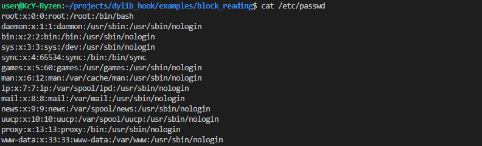
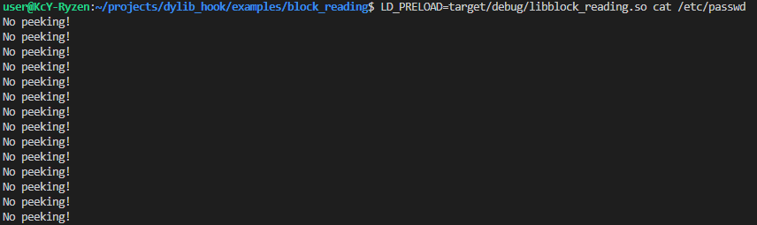

# Rust Dylib Hijacking Framework

[](https://crates.io/crates/dylib_hook)
[](https://github.com/KeiranY/dylib_hook/blob/main/LICENSE)
[](https://github.com/KeiranY/dylib_hook/actions/workflows/ci.yml)

This project provides a framework for hooking functions loaded from dynamic libraries on Linux. It allows you to intercept and modify the behavior of functions at runtime, making it useful for debugging, monitoring, or altering the behavior of existing applications.

## Example

To run the example provided in this project, follow these steps:

1. Navigate to the `examples/block_reading` directory:
   ```bash
   cd examples/block_reading
   ```

2. View the contents of `/etc/passwd` to observe the original behavior:
   ```bash
   cat /etc/passwd
   ```
    

3. Build the example:
   ```bash
   cargo build
   ```

4. Use the `LD_PRELOAD` environment variable to load the hook and run the example:
   ```bash
   LD_PRELOAD=target/debug/libblock_reading.so cat /etc/passwd
   ```
    


## Usage

### Installation

To use this framework, configure your `Cargo.toml` file as follows:

```toml
[lib]
crate-type = ["cdylib"]

[dependencies]
ctor = "0.4"
libc = "0.2"
dylib_hook = "0.1"
```

`libc` is a required addition, `ctor` provides a helpful way of adding hooks on load.


### Creating a Hook

Use the `create_hook!` macro to define a hook for a specific function. For example:

```rust
create_hook!(open(cpath: *const c_char, oflag: c_int) -> c_int);
```


Or, use the `create_hooks!` macro to define multiple hooks at once. For example:

```rust
create_hooks!(
    open(cpath: *const c_char, oflag: c_int) -> c_int,
    openat(dirfd: c_int, cpath: *const c_char, oflag: c_int) -> c_int
);
```

This will generate hooks for both `open` and `openat` functions.

### Adding a Hook

Define a hook function and add it using the `add_hook` method. The hook function's signature must match the original function's signature, with an additional `Chain` parameter as the last argument. For example:

```rust
fn hook_fn(cpath: *const c_char, oflag: c_int, chain: &mut open::Chain) -> c_int {
    println!("Intercepted call to open()");

    // Modify parameters before calling the chain
    let modified_oflag = oflag | libc::O_APPEND;

    // Call the next hook or the original function
    let mut result = chain.call(cpath, modified_oflag);

    // Modify the result after the call
    if result < 0 {
        println!("open() failed, returning a default file descriptor");
        result = 3; // Example: return a default file descriptor
    }

    result
}

open::add_hook(hook_fn);
```

The `Chain` parameter allows you to continue the chain of hooks towards the original function. You can also modify the parameters before calling the chain and adjust the result after the call.

### Calling the Original Function

You can bypass hooks and call the original function directly:

```rust
let fd = open::call_orig(cpath, oflag);
```

### Disabling and Enabling Hooks

You can manage the behavior of hooks using the following methods:

- **Temporarily bypass hooks**: Use `bypass_hooks` to execute a block of code without triggering any hooks.
- **Permanently disable all hooks**: Use `disable_hooks` to stop hooks from being triggered globally until explicitly re-enabled.
- **Re-enable all hooks**: Use `enable_hooks` to restore hook functionality globally after it has been disabled.

Examples:

```rust
use std::fs::File;
use std::io::{self, Read};

// Temporarily bypass all hooks
bypass_hooks(|| {
    let mut file = File::open("example.txt").unwrap();
    let mut contents = String::new();
    file.read_to_string(&mut contents).unwrap();
    println!("Bypassed hooks, file contents: {}", contents);
});

// Permanently disable all hooks
disable_hooks();

// Use Rust's standard library to open and read a file without triggering hooks
let mut file = File::open("example.txt").unwrap();
let mut contents = String::new();
file.read_to_string(&mut contents).unwrap();
println!("File contents: {}", contents);

// Re-enable all hooks
enable_hooks();
```
